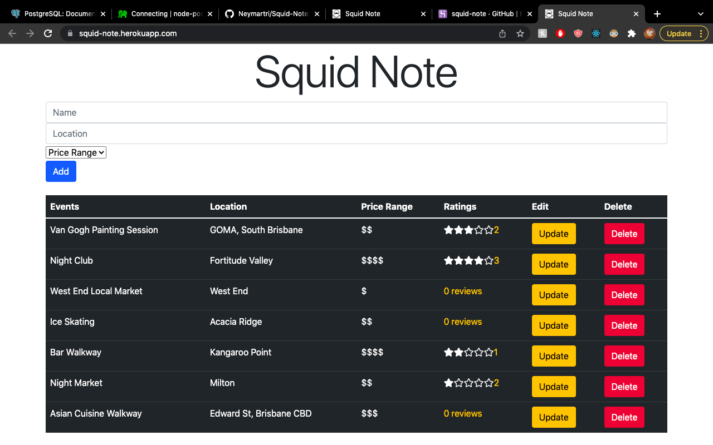
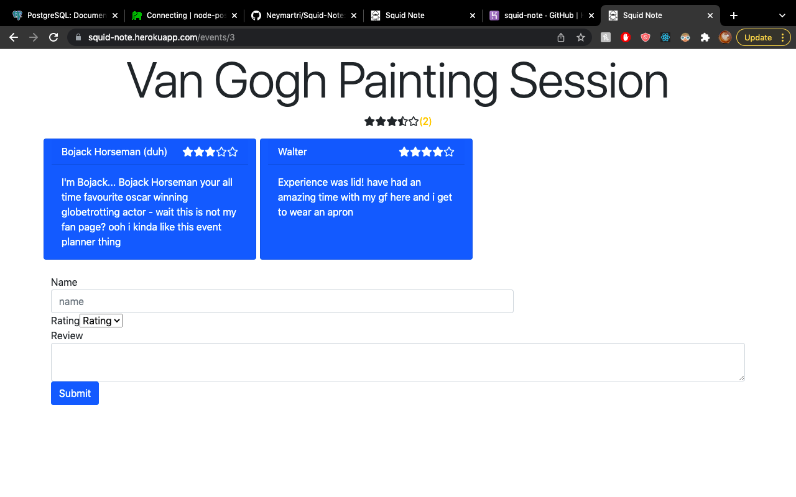
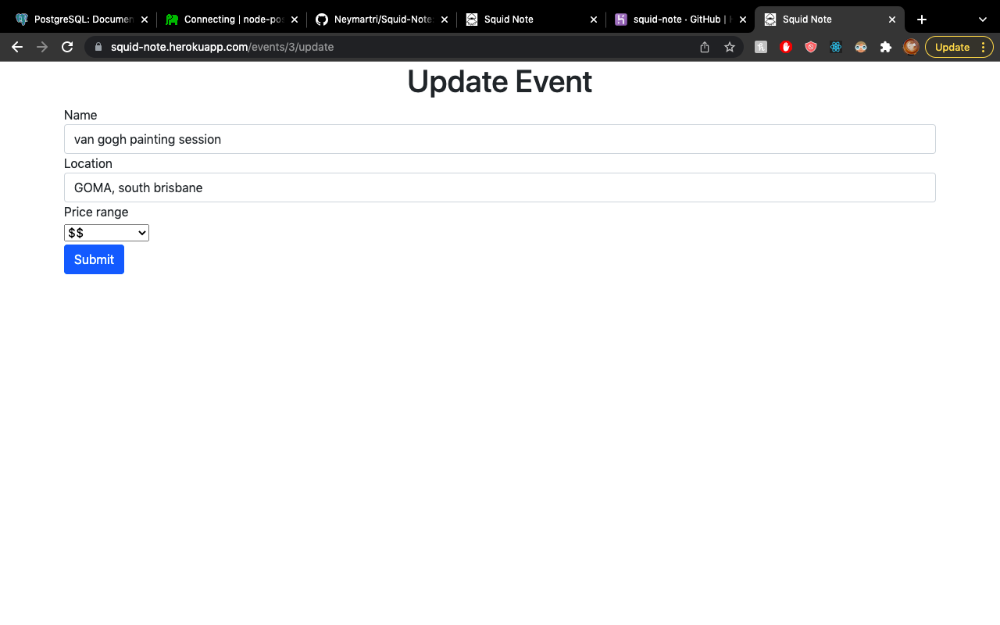

  <h2 align="center">Squid Note</h2>
  <h3 align="center">Coder Academy Assignment 2A & 2B - Term 3</h3>
  

    <a href="https://github.com/Neymartri/Squid-Note">Link to Repository</a>
    . 
    <a href="https://squid-note.herokuapp.com/">squid-note.herokuapp.com</a>
  

## About the Project

### **Built With (Tech Stack)**

The core programming languages/frameworks/libraries used to build this application are:

### NodeJS [Read Docs](https://nodejs.org/en/docs/guides/)

Node.js is designed to build scalable network applications. In the following "hello world" example, many connections can be handled concurrently. It was used to create the backend API that has data stored in it's accompanying Postgresql database. It was chosen for it's simplicity to create a full stack application with little extra dependencies. In the ExpressJS framework, Node will essentially handle all the server side code when the client requires it.

### HTML5 [Read Docs (Not official)](https://developer.mozilla.org/en-US/docs/Web/HTML)

HTML is the provider structure of every website. With the latest version HTML5 bringing easy to read semantic tagging with some client side validation within forms. HTML sites in every React component that's rendered as JSX.

### CSS3 [Read Docs (Not official)](https://developer.mozilla.org/en-US/docs/Web/CSS)

Cascading style sheets (CSS) is the framework for adding visual styles to the structure of our website. CSS libraries used for this project are Bootstrap and Styled Components. Bootstrap and Styled Component sit inside each React Component while minor amendments to these frameworks sits in a corresponding CSS file.

### JavaScript (ES6) [Read Docs](https://262.ecma-international.org/6.0/)

Javascript (& ES6) is the core functionality of the front-end part of this site. Javascript and React form the logic part of a website for the Views (part of the MVC framework).  

### ReactJS [Read Docs](https://reactjs.org/)

React is a Javascript library that uses component-based methodology this makes for easy single page applications and the reason React was the library used for this assignment. React uses state management and hooks (with functional components) that give it an advantage over Vanilla Javascript.

### Postgresql [Read Docs](https://www.postgresql.org/)

Postgresql is an open source relational database commonly used with tech stack like PERN. It was used for this assignment as it formed part of the curriculum and was easy to use and set up.

### ExpressJS [Read Docs](https://expressjs.com/en/guide/routing.html)

Express.js, or simply Express, is a back end web application framework for Node.js, It has been called the de facto standard server framework for Node.js as its purposes is built around configuration and granular simplicity of connect middleware which is complmentary with NodeJS
## R1 Description of your website, including:
****Purpose****

The main idea for "Squid Note" is to be able to make planning an event alot eaiser for people with no time and in a buget. 

there will be a keyword bar where you can type in what sort of event they are after. 

****Functionality / Features****

once a user logged in , the user will be able to create their own customised event planning board, first can seach for the event.

- The user could update their event and check for reviews from selected event 

- User could also delete their unwanted event or add new events they would like to attend

- Login/register is a future function would be implement for interaction between users and open up possiblities to create personal data storage of liked/ following places or save place of interests 

- The reviews rating are counted from the average of all users and divided for deciding 

***Target Audience***

Our target audience are mainly for people who are new to planning events.

​	- Familys 

​	- Anyone on a buget 

​	- Group of friends 

​	- People with no idea where to start when it comes to planning an event .

This app will be good for people with no time to look around for everthing they will to plan an event . the app will be able to help them list out the items they need and places idea for their desire event. 

****Tech Stack**** 

The backend of the "Squid note" we will be using Ruby on Rails , set up in API mode . This will be integrated with Postgresql database and hosted on Heroku. Two Ruby gems will be incorporated to permit secure user logon knock (to generate the JavaScript web token for user authentication), and bcryot (to provide the password hashing algorithm).

The app will be completley free of charge, but in the future we might implement the payment gems (Stripe) for users to be able to make direct payment with us. 

The Front-end will utilise React.js, and be hosted on Netifly. It will communicate with the Rails API using HTTP client. the useState, useEffect, and useContext hooks will be utilized where applicable.

Testing will be performed using cypress.js.

## R2 Dataflow Diagram

Entity Relationship Diagram

## R3 Application Architecture Diagram

## R4 User Stories

User Expectations:

All users will expect the following features or functionality:

- It makes it impossible for users to use it unless they log in so that they can record their own events.

- The layout is designed so that you can recognize the events created by the user at a glance.

- Through search and filter, user can get suggestions for the items you want to find.

- It displays all the information you need to know through a dashboard familiar to the user.

- It makes it possible to quickly and easily create, view, update, and delete all event items.

- The number and cost of items in all products can be recorded and they are calculated.

User Characterisitics

Three distinct target user types were considered:

- Mark is going to choose his mother's birthday present. He was suggested a gift for his mother after choosing the age group and gender through the squid note. And he will make a list and think about what would be suitable.

- Here is a man named John who wants to marry his beloved girlfriend two months later. He wants to record simple plans and costs. In this case, he can search all the items and costs you need through squid note

- Chloe is an event planner. She needs an app that can manage various events. In this case, she can manage the lists you have recorded for each title along with the total cost.

## R5 WireFrames

- Pop Up

- Sign Up

- Home(Event Preview)

- Search 

- Filter

- Edit

- View Detail

## R6 Screenshots of your Trello board throughout the duration of the project
Day 1.

Day 2.

Day 3.

### **Third Party Apps/Services**

Here are the third party applications used for Squid Note:

- [Heroku](https://www.heroku.com/): This is a cloud platform that lets the user build, deliver, monitor and scale applications. This means a user can host their full stack application on the internet for free. But for this application Heroku will take care of the backend.
- [GitHub](https://github.com/): An online platform for users to store public and private coding projects for free. This platform pairs with Heroku and Netlify. Github stores the code and Heroku provides the server to fetch the code and send it to the browser. It is also the platform that allow the team to store the code in a single repository and keeps track of all the git commits and merging.
- [Git](https://git-scm.com/): Version control software that is free. It helps the user keep track of changes allowing them to branch and rollback revisions.
- [Bootstrap 5](https://getbootstrap.com/): Bootstrap makes putting HTML and CSS together on the web browser simple. By streamlining the code required visually appealing layouts can be
- [Figma](https://figma.com/): This program allows users with little amount of graphic design skills to make mock versions of websites, business cards and other mock ups.
- [Trello](https://trello.com/): This is a project management tool used to keep track of features and items that need to be done. Our Trello board can be viewed [here](https://trello.com/b/EqmkRV5j/big-boys-coding-project).
- [Lucidchart](https://www.lucidchart.com/pages/): An online platform used to give a visual display of the Entity Relationship Diagram for the back end on Squid Note.
- [Visual Studio Code](https://code.visualstudio.com/): The most popular code editing software with plenty of extensions to help code this application. VS Code is owned by Microsoft and is free to use.

## Contributors

- Ethan Khoa Tran - Organising the documentation and Programming both front and back-end development, architecture design and database. [Github](https://github.com/Neymartri)

- Job Alvarez (Left) - Documenting Trello, Idea Planning 

- eunkyuchloe (Left) -  Wireframing, T3A2 - A documenting. 

### **Testing**

The initial purpose was to write tests ahead of coding and while sorting out role for this project, the group ended up individually while testing things manually making sure our results came through with console logs and writing proper unit tests after the code was written to eliminate potential bugs. 

Furthermore, implementing Postman to test out API calls to to database functioning with both front end and back end. This is not quite how test driven development should work. For future projects a function should be written and the testing file created at the same time with tests written at the time of the function.

Unit testing involves going through each individual function and testing to see if it's running as intended by checking to see if the output is correct. Just like functions each test should have one purpose.

Jest is a testing library. It is used for React to check components are rendering and each function is producing an output as intended.

After unit testing is integration testing. This tests the API is working, components render and it's all come together.

As this project had no real client the test of production and the local server as if user were using the application for the first time.

### **Walkthrough**
Squid Note: launched on Heroku App 

Review Page when click on the name of selected Event

UpdatePage when user click on the update button will be redirected here

## Forking The Project To Contribute

Contributions are what make the open source community such an amazing place to be learn, inspire, and create. Any contributions you make are appreciated.

1. Fork the Project
2. Create your Feature Branch (`git checkout -b YourBranchName`)
3. Commit your Changes (`git commit -m 'Add a feature/amendment'`)
4. Push to the Branch (`git push origin YourBranchName`)
5. Open a Pull Request

## Acknowledgments

- A warm appreciation to the team @[Coder Academy](https://www.coderacademy.edu.au/) for their support.